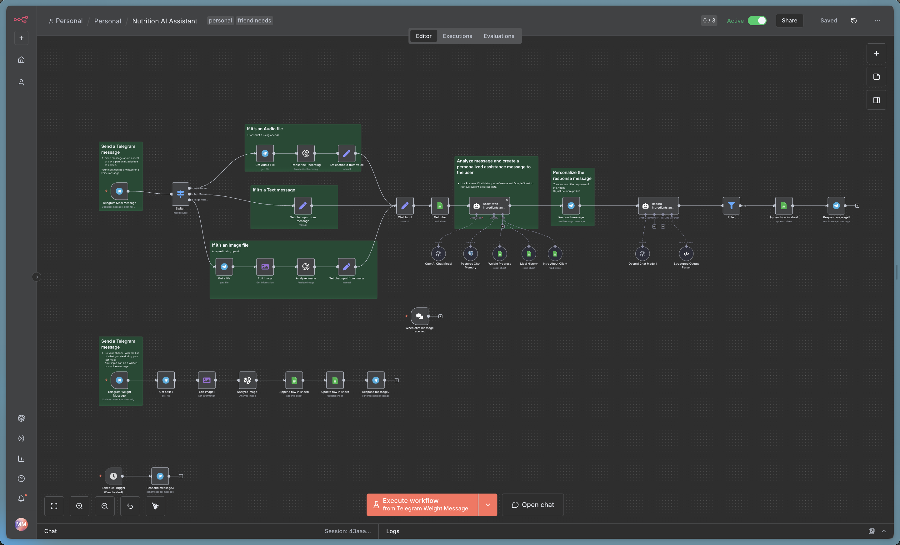

# 🥗 AI Nutrition Assistant



A comprehensive n8n workflow that transforms your Telegram into an intelligent nutrition tracking and coaching assistant. This automation combines the power of OpenAI's GPT-4, Google Sheets data management, and Telegram's convenience to provide personalized nutrition guidance and seamless meal logging.

## ✨ Key Benefits

### 🎯 **Personalized Nutrition Coaching**

- **AI-Powered Analysis**: Advanced GPT-4 integration provides detailed nutritional breakdowns of your meals
- **Contextual Advice**: Personalized recommendations based on your goals, current weight, and meal history
- **Progress Tracking**: Continuous monitoring of your nutrition journey with intelligent insights

### 📱 **Effortless Meal Logging**

- **Multi-Modal Input**: Log meals via text, voice messages, or photos through Telegram
- **Smart Image Recognition**: AI analyzes food photos to identify ingredients and estimate portions
- **Voice Transcription**: Speak your meals naturally - the system transcribes and processes automatically
- **Instant Feedback**: Get immediate nutritional analysis and coaching advice

### 📊 **Comprehensive Data Management**

- **Automated Spreadsheet Integration**: All data seamlessly stored in Google Sheets for easy access
- **Weight Progress Tracking**: Visual weight scale reading through image analysis
- **Historical Analysis**: Access to complete meal and weight history for trend analysis
- **Real-time Updates**: Live synchronization between Telegram interactions and data storage

### 🤖 **Intelligent Automation**

- **Context-Aware Responses**: AI remembers your preferences, goals, and dietary patterns
- **Multi-Language Support**: Responds in Ukrainian with natural, conversational tone
- **Smart Filtering**: Distinguishes between meal logging and general nutrition questions
- **Scheduled Reminders**: Optional automated prompts to maintain consistent tracking

## 🚀 Features

### Core Functionality

#### 📝 **Meal Tracking**

- **Text Input**: Simply type what you ate: "Grilled chicken breast with rice and vegetables"
- **Voice Messages**: Record voice notes describing your meals for hands-free logging
- **Photo Analysis**: Take pictures of your food for automatic ingredient identification and calorie estimation
- **Nutritional Breakdown**: Detailed analysis of calories, proteins, fats, and carbohydrates per ingredient

#### ⚖️ **Weight Monitoring**

- **Scale Photo Recognition**: Take a photo of your digital scale for automatic weight logging
- **Progress Tracking**: Historical weight data stored and analyzed for trends
- **Goal Alignment**: Weight progress compared against personal goals and targets

#### 🧠 **AI Coaching**

- **Personalized Advice**: Tailored recommendations based on your profile and goals
- **Meal Optimization**: Suggestions for improving nutritional balance
- **Progress Insights**: Analysis of eating patterns and weight trends
- **Educational Content**: Nutritional facts and healthy eating tips

### Technical Features

#### 🔄 **Multi-Input Processing**

- **Smart Message Routing**: Automatically detects and processes different message types (text, voice, image)
- **Context Preservation**: Maintains conversation history using PostgreSQL chat memory
- **Error Handling**: Robust processing with retry mechanisms and fallback options

#### 📈 **Data Integration**

- **Google Sheets Backend**: Structured data storage with multiple sheets for different data types
- **Real-time Synchronization**: Instant updates between Telegram and spreadsheet data
- **Data Validation**: Ensures data integrity and proper formatting

#### 🛡️ **Security & Privacy**

- **Secure API Integration**: Encrypted connections to all external services
- **User Session Management**: Individual user data isolation and management
- **Credential Management**: Secure handling of API keys and authentication tokens

## 🛠️ Setup Instructions

### Prerequisites

1. **n8n Instance**: Self-hosted or cloud n8n installation
2. **Telegram Bot**: Create a bot via [@BotFather](https://t.me/botfather)
3. **OpenAI API Key**: GPT-4 access for AI analysis
4. **Google Sheets API**: Service account with Sheets API access
5. **PostgreSQL Database**: For chat memory storage (optional but recommended)

### Required Credentials

#### Telegram Bot Setup

1. Message [@BotFather](https://t.me/botfather) on Telegram
2. Create a new bot with `/newbot`
3. Save the bot token for n8n configuration
4. Configure bot settings (privacy mode, group permissions)

#### OpenAI Configuration

1. Obtain API key from [OpenAI Platform](https://platform.openai.com)
2. Ensure GPT-4 access is available
3. Configure usage limits and monitoring

#### Google Sheets Integration

1. Create a Google Cloud Project
2. Enable Google Sheets API
3. Create service account credentials
4. Share your tracking spreadsheet with the service account email

#### PostgreSQL Setup (Optional)

1. Set up PostgreSQL database
2. Create database for chat memory storage
3. Configure connection credentials in n8n

### Installation Steps

1. **Import Workflow**

   ```bash
   # Import the workflow.json file into your n8n instance
   ```

2. **Configure Credentials**

   - Add Telegram Bot credentials
   - Set up OpenAI API connection
   - Configure Google Sheets OAuth2
   - Add PostgreSQL connection (if using chat memory)

3. **Set Up Google Sheets**

   - Create a new Google Spreadsheet
   - Set up sheets: "Intro", "Meals", "Weights"
   - Configure column headers as per workflow requirements
   - Update spreadsheet ID in workflow nodes

4. **Customize Settings**

   - Update Telegram chat IDs
   - Modify AI prompts for your language/preferences
   - Adjust scheduling triggers if needed

5. **Test Integration**
   - Send test messages to your bot
   - Verify data appears in Google Sheets
   - Test different input types (text, voice, image)

## 📱 Usage Guide

### Getting Started

1. **Initial Setup**: Send a message to your Telegram bot to initiate the conversation
2. **Profile Configuration**: Set up your profile information in the Google Sheets "Intro" tab
3. **Start Logging**: Begin tracking meals and weight through Telegram

### Meal Logging

#### Text Messages

```
"Breakfast: 2 eggs, whole wheat toast, avocado"
"Lunch at restaurant: Caesar salad with grilled chicken"
"Snack: Apple and peanut butter"
```

#### Voice Messages

- Record natural speech describing your meals
- AI transcribes and processes the content automatically
- Perfect for hands-free logging while cooking or eating

#### Photo Analysis

- Take clear photos of your meals
- AI identifies ingredients and estimates portions
- Works best with well-lit, unobstructed food images

### Weight Tracking

1. **Scale Photos**: Take a clear photo of your digital scale display
2. **Automatic Recognition**: AI reads the weight value from the image
3. **Data Storage**: Weight automatically logged with timestamp
4. **Progress Updates**: Current weight updated in your profile

### Getting Advice

Ask questions like:

- "What should I eat for dinner?"
- "How am I doing with my weight loss goal?"
- "Is this meal healthy for my goals?"
- "What changes should I make to my diet?"

## 📊 Data Structure

### Google Sheets Organization

#### Intro Sheet

- Client information and goals
- Current and target weight
- Height and personal metrics
- Goal tracking parameters

#### Meals Sheet

- Date and time of meals
- Meal descriptions and ingredients
- Calculated calories and macronutrients
- AI analysis and recommendations

#### Weights Sheet

- Date and time of weigh-ins
- Weight measurements
- Progress tracking
- Trend analysis data

## 🔧 Customization Options

### Language Adaptation

- Modify AI prompts for different languages
- Customize response templates
- Adjust cultural food preferences

### Notification Settings

- Configure reminder schedules
- Customize message templates
- Set up progress alerts

### Data Export

- Export Google Sheets data for analysis
- Integration with fitness apps
- Custom reporting and visualization

## 🤝 Use Cases

### Personal Health Management

- **Weight Loss Journey**: Track calories and monitor progress toward weight goals
- **Fitness Optimization**: Balance macronutrients for athletic performance
- **Health Condition Management**: Monitor dietary restrictions and nutritional needs

### Professional Applications

- **Nutritionist Tools**: Client tracking and progress monitoring
- **Fitness Coaching**: Comprehensive nutrition support for training programs
- **Healthcare Integration**: Dietary monitoring for medical conditions

### Family & Group Usage

- **Family Nutrition**: Track multiple family members' dietary habits
- **Group Challenges**: Shared nutrition goals and accountability
- **Educational Tool**: Learn about nutrition through interactive tracking

## 🛡️ Privacy & Security

- **Data Encryption**: All API communications are encrypted
- **User Isolation**: Individual user data is kept separate and secure
- **Credential Security**: API keys and tokens are securely managed
- **Data Retention**: Configure data retention policies as needed

## 📈 Performance & Scalability

- **Efficient Processing**: Optimized for quick response times
- **Scalable Architecture**: Handles multiple concurrent users
- **Resource Management**: Intelligent API usage to minimize costs
- **Error Recovery**: Robust error handling and retry mechanisms

## 🔄 Updates & Maintenance

- **Regular Backups**: Automated backup of workflow and data
- **Version Control**: Track changes and updates to the workflow
- **Monitoring**: Set up alerts for system health and performance
- **Documentation**: Keep setup and customization notes updated

## 📞 Support & Troubleshooting

### Common Issues

- **Bot Not Responding**: Check Telegram webhook configuration
- **AI Analysis Errors**: Verify OpenAI API key and credits
- **Data Not Saving**: Confirm Google Sheets permissions and IDs
- **Image Recognition Issues**: Ensure clear, well-lit photos

### Getting Help

- Review n8n workflow execution logs
- Check API rate limits and quotas
- Verify all credential configurations
- Test individual workflow nodes

---

**Transform your nutrition journey with intelligent automation. Start tracking smarter, not harder! 🚀**
